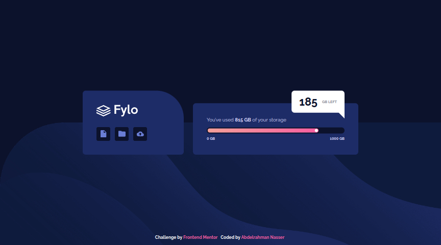

# Frontend Mentor - Fylo Data Storage Component solution

This is a solution to the [Fylo Data Storage Component challenge on Frontend Mentor](https://www.frontendmentor.io/challenges/fylo-data-storage-component-1dZPRbV5n). Frontend Mentor challenges help you improve your coding skills by building realistic projects.

## Table of contents

- [Overview](#overview)
  - [The challenge](#the-challenge)
  - [Screenshot](#screenshot)
  - [Links](#links)
- [My process](#my-process)
  - [Built with](#built-with)
  - [Continued development](#continued-development)
- [Author](#author)

## Overview

### The challenge

Users should be able to:

- View the optimal layout for the component depending on their device's screen size

### Screenshot

### Links

- [Solution URL](https://www.frontendmentor.io/solutions/fylo-data-storage-component-using-sass-AN4GSuxNEC)
- [Preview URL](https://abdelrahmancsdev.github.io/fylo-data-storage-component/)

## My process

### Built with

- HTML5
- Sass

### Continued development

I will work on making more Frontend Mentor projects.

## Author

- Website - [Abdelrahman Nasser](https://www.abdelrahmancs.dev)
- Frontend Mentor - [@abdelrahmancsdev](https://www.frontendmentor.io/profile/abdelrahmancsdev)
- Linkedin - [@abdelrahmancsdev](https://www.linkedin.com/in/abdelrahmancsdev/)
